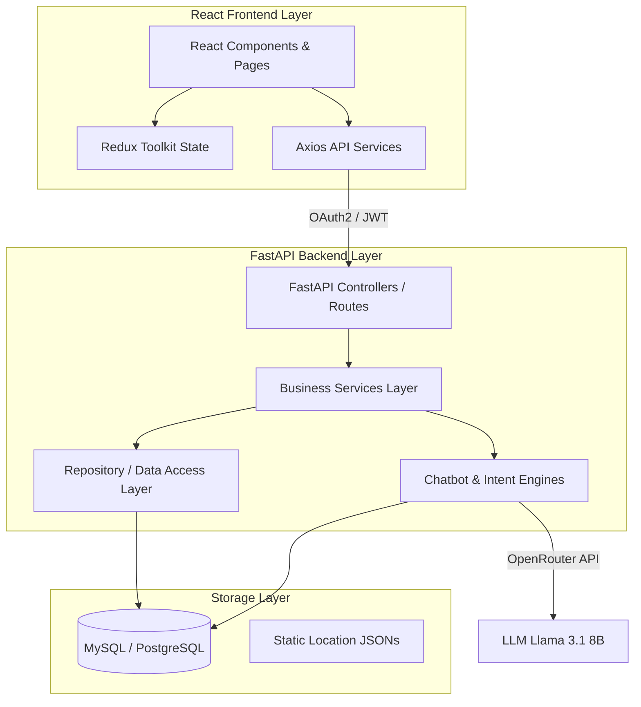
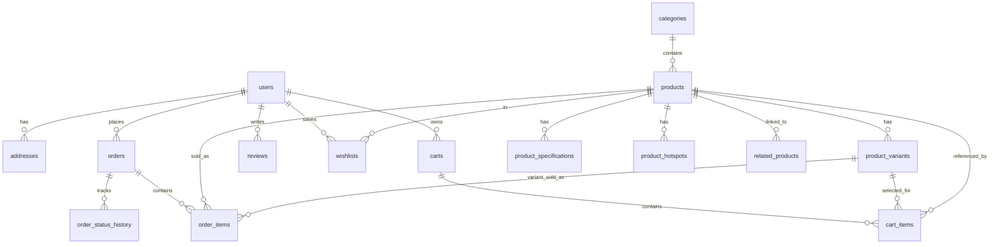
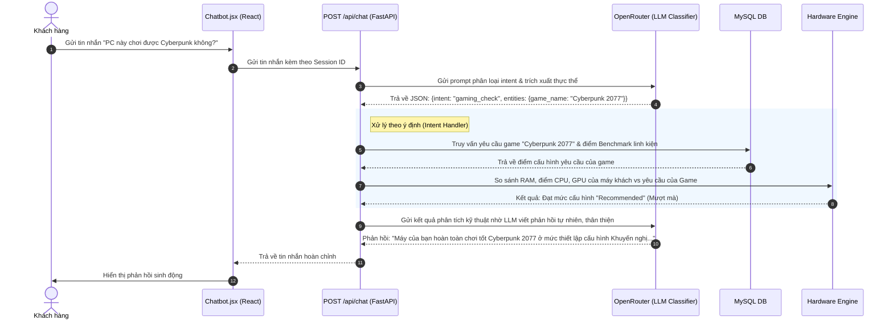
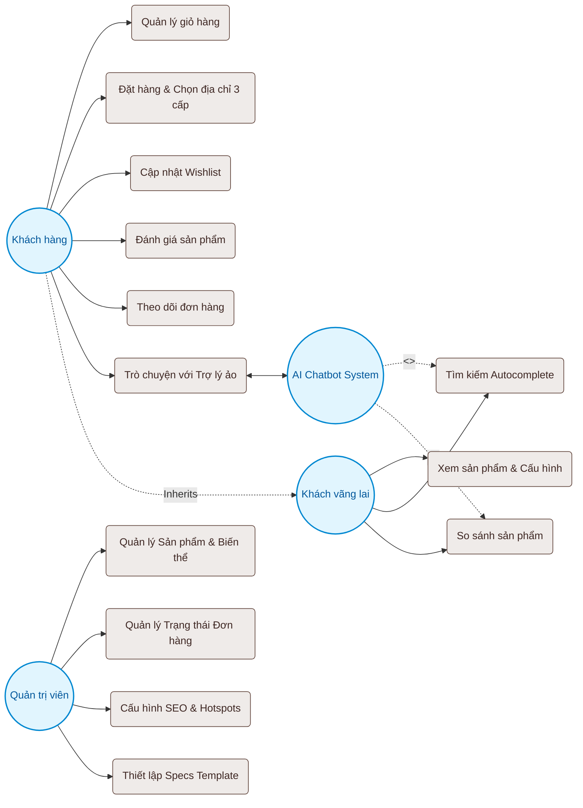
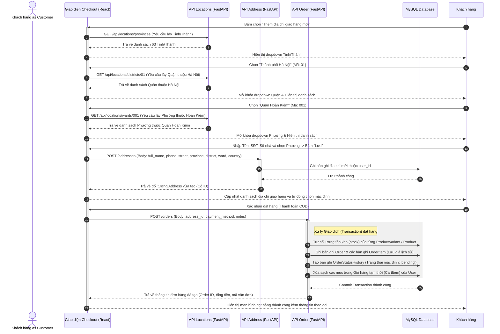
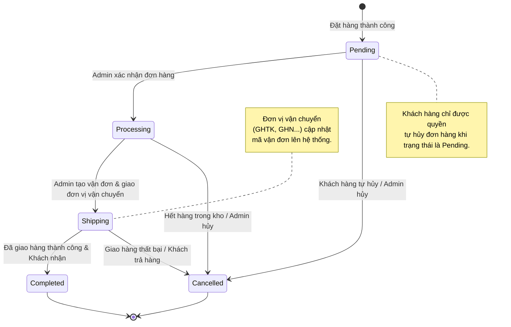
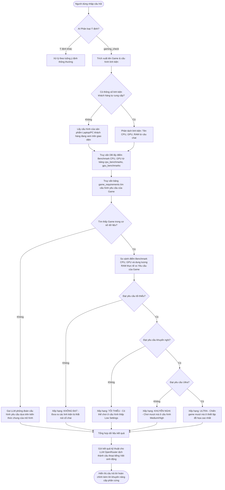

# 📘 Tài liệu Ngữ cảnh Hệ thống Toàn diện (System Context Document)

Tài liệu này được biên soạn đặc biệt dành cho các mô hình ngôn ngữ lớn (AI Models) để hiểu rõ thiết kế kiến trúc, cấu trúc cơ sở dữ liệu, các luồng nghiệp vụ cốt lõi và các tính năng nâng cao của **Nền tảng Thương mại Điện tử Đồ điện tử (Electronics E-Commerce Platform)**.

---

## 🗺️ 1. Tổng quan Kiến trúc Hệ thống

Hệ thống được thiết kế theo mô hình **Client-Server truyền thống kết hợp Trí tuệ Nhân tạo (AI Support Agent)**, sử dụng bộ công nghệ hiện đại, phân tách rõ ràng trách nhiệm giữa các lớp (Layered Architecture).



### Lựa chọn Công nghệ (Tech Stack)
*   **Frontend**: React 18, Vite, TypeScript, Tailwind CSS, Redux Toolkit để quản lý trạng thái, `react-i18next` hỗ trợ đa ngôn ngữ (EN/VI).
*   **Backend**: FastAPI (Python), uvicorn làm ASGI server, SQLAlchemy ORM để truy xuất CSDL, Pydantic để kiểm tra và định dạng dữ liệu (validation & serialization), JWT (JSON Web Tokens) cho cơ chế xác thực.
*   **AI Integration**: OpenRouter API (`meta-llama/llama-3.1-8b-instruct`) để phân loại ý định (Intent Classification) và phân tích thực thể (Entity Extraction).
*   **Cơ sở dữ liệu**: MySQL hoặc PostgreSQL (tương thích hoàn toàn qua SQLAlchemy), lưu trữ tập tin cục bộ cho ảnh tải lên (Static uploads).

---

## 📁 2. Tổ chức Codebase & Cấu trúc Thư mục

### 💻 Frontend Architecture (`/Frontend`)
Tổ chức code theo nguyên lý module hóa, tái sử dụng component cao:
*   `src/components/`: Chứa các component giao diện dùng chung. Các component đặc thù bao gồm:
    *   `AddressSelector.jsx`, `ProvinceSelect.jsx`, `DistrictSelect.jsx`, `WardSelect.jsx`: Trình chọn địa chỉ 3 cấp đồng bộ dữ liệu.
    *   `Combobox.jsx`: Thành phần dropdown tìm kiếm có hỗ trợ điều hướng bàn phím.
    *   `Chatbot.jsx`: Giao diện chatbot AI thông minh nổi trên màn hình.
    *   `ProductCard.jsx`, `VariantSelector.jsx`, `SpecificationEditor.jsx`: Thành phần hiển thị và cấu hình chi tiết sản phẩm.
    *   `CompareButton.jsx`, `WishlistButton.jsx`: Tương tác tính năng so sánh và danh sách yêu thích.
*   `src/pages/`: Chứa các trang chính (Home, ProductDetail, Cart, Checkout, Profile, CompareProducts, Wishlist, và các trang quản trị `admin/`).
*   `src/store/`: Cấu hình Redux Store (`store.js`) và các Slices để quản lý Global State (`authSlice.js`, `cartSlice.js`, `themeSlice.js`, v.v.).
*   `src/services/`: Lớp gọi API thông qua Axios (`api.js` cấu hình chung, `productService.js` chứa các lệnh gọi API liên quan sản phẩm/địa chỉ).
*   `src/locales/`: Các file dịch JSON (`en.json`, `vi.json`) để thực hiện i18n đa ngôn ngữ.

### ⚙️ Backend Architecture (`/Backend`)
Backend tuân thủ nghiêm ngặt mô hình **Controller - Service - Repository (CSR)**:
*   `app/main.py`: Điểm khởi chạy FastAPI, đăng ký middleware (CORS, Rate Limiter của slowapi), xử lý ngoại lệ (Exception handlers), tự động kiểm tra và đồng bộ cấu trúc Schema (Dynamic Migration).
*   `app/controllers.py`: Định nghĩa các API endpoints, thực hiện phân quyền dựa trên OAuth2 (`Depends(get_current_user)`) và kiểm tra dữ liệu đầu vào bằng Pydantic.
*   `app/services.py`: Lớp logic nghiệp vụ chứa các giải thuật xử lý, điều phối các repository, quản lý transaction.
*   `app/repositories.py`: Lớp trừu tượng hóa truy vấn CSDL bằng SQLAlchemy ORM, đảm bảo hiệu suất truy vấn (chống N+1 query bằng `joinedload`).
*   `app/models.py`: Định nghĩa các thực thể CSDL (SQLAlchemy ORM models).
*   `app/schemas.py`: Định nghĩa cấu trúc dữ liệu gửi và nhận qua API (Pydantic models).
*   `app/chat_service.py` & `app/chatbot/`: Xử lý toàn bộ logic liên quan đến chatbot AI, công cụ so sánh cấu hình phần cứng, đánh giá hiệu năng chơi game (gaming eligibility).

---

## 🗄️ 3. Cơ cấu Cơ sở Dữ liệu & Thiết kế Thực thể

Tất cả các khóa chính (`id`) sử dụng định dạng **UUID (String 36 ký tự)** được sinh tự động nhằm bảo mật và dễ đồng bộ dữ liệu. Mối quan hệ giữa các bảng được tối ưu hóa bằng các ràng buộc khóa ngoại (Foreign Keys) và cơ chế xóa dây chuyền (`cascade="all, delete-orphan"`).

### Sơ đồ Quan hệ Thực thể (Entity Relationship Overview)



### Chi tiết các bảng Cơ sở Dữ liệu

#### 👥 Phân hệ Người dùng & Xác thực
1.  **`users`**: Quản lý tài khoản người dùng.
    *   `id` (String-36, PK)
    *   `email` (String-255, Unique, Indexed)
    *   `hashed_password` (String-255)
    *   `full_name` (String-255)
    *   `avatar_url` (Text)
    *   `is_admin` (Boolean, Default: False)
    *   `role` (String-255, Default: 'user' - Hỗ trợ phân quyền admin/user)
    *   `created_at` (DateTime)
2.  **`addresses`**: Quản lý sổ địa chỉ giao hàng của người dùng.
    *   `id` (String-36, PK)
    *   `user_id` (String-36, FK -> `users.id`)
    *   `full_name` (String-255): Tên người nhận.
    *   `phone` (String-64): Số điện thoại liên hệ.
    *   `street` (Text): Số nhà, tên đường.
    *   `province` (String-255): Tỉnh/Thành phố.
    *   `district` (String-255): Quận/Huyện.
    *   `ward` (String-255): Phường/Xã.
    *   `country` (String-255, Default: "Vietnam")
    *   `is_default` (Boolean, Default: False): Địa chỉ mặc định.
3.  **`password_reset_tokens`** & **`email_change_tokens`**: Phục vụ việc đổi mật khẩu và đổi email an toàn bằng mã token hết hạn.

#### 📦 Phân hệ Danh mục & Sản phẩm
4.  **`categories`**: Phân loại sản phẩm dạng cây phân cấp (Hierarchical Tree).
    *   `id` (String-36, PK)
    *   `name` (String-255)
    *   `slug` (String-255, Unique, Indexed)
    *   `description` (Text)
    *   `parent_id` (String-36, FK -> `categories.id` - Cho phép lồng danh mục không giới hạn)
    *   `level` (Integer, Default: 0)
    *   `path` (Text): Đường dẫn danh mục (ví dụ: `/may-tinh/laptop-gaming`).
5.  **`products`**: Thông tin tổng quan sản phẩm điện tử.
    *   `id` (String-36, PK)
    *   `name` (String-255)
    *   `description` (Text)
    *   `price` (Float): Giá cơ bản.
    *   `stock` (Integer): Số lượng tồn kho.
    *   `category_id` (String-36, FK -> `categories.id`)
    *   `image_url` (Text): Hình ảnh chính.
    *   `brand` (String-255): Thương hiệu (ví dụ: Apple, Asus).
    *   `sku` (String-255, Unique, Indexed): Mã định danh kho hàng.
    *   `product_type` (String-255): Loại sản phẩm (ví dụ: phone, laptop, audio).
    *   `rating` (Float, Default: 0.0): Điểm đánh giá trung bình.
    *   `review_count` (Integer, Default: 0): Số lượt đánh giá.
    *   `featured` (Boolean, Default: False): Đánh dấu sản phẩm nổi bật.
    *   `status` (String-255, Default: "active")
    *   `view_count` (Integer, Default: 0): Lượt xem phục vụ thuật toán gợi ý.
    *   `embedding` (JSON): Vector nhúng phục vụ tìm kiếm ngữ nghĩa sau này.
6.  **`product_variants`**: Phiên bản chi tiết của sản phẩm (ví dụ: iPhone 15 Pro - Màu Titan - RAM 8GB - Bộ nhớ 256GB).
    *   `id` (String-36, PK)
    *   `product_id` (String-36, FK -> `products.id`)
    *   `color_name` (String-255), `color_code` (String-50)
    *   `version_name` (String-255) (ví dụ: "Pro Max")
    *   `ram` (String-255), `storage` (String-255)
    *   `sku` (String-255)
    *   `price` (Float): Giá bán thực tế của phiên bản này.
    *   `compare_price` (Float): Giá niêm yết cũ để hiển thị giảm giá.
    *   `stock` (Integer)
    *   `image_url` (Text)
    *   `is_default` (Boolean, Default: False): Phiên bản mặc định khi vào trang chi tiết.
7.  **`product_specifications`**: Thông số kỹ thuật chi tiết của sản phẩm.
    *   `id` (String-36, PK)
    *   `product_id` (String-36, FK -> `products.id`)
    *   `group_name` (String-255): Nhóm thông số (ví dụ: "Màn hình", "Bộ vi xử lý").
    *   `spec_key` (String-255): Tên thông số (ví dụ: "Tần số quét", "CPU").
    *   `spec_value` (Text): Giá trị (ví dụ: "120Hz", "Intel Core i7-13700H").
    *   `display_order` (Integer): Thứ tự hiển thị trên bảng thông số.
8.  **`spec_templates`**: Bản mẫu thông số kỹ thuật mặc định theo từng loại sản phẩm (`product_type`) để Admin dễ dàng nhập liệu đồng bộ.
9.  **`product_hotspots`**: Tọa độ các điểm tương tác trên ảnh sản phẩm (Interactive Image Hotspots).
    *   `x_percent` / `y_percent` (Float): Tọa độ % trên ảnh sản phẩm.
    *   `label` / `description` (String/Text): Nhãn và mô tả chi tiết tính năng khi rê chuột vào điểm hotspot.
10. **`related_products`**: Liên kết các sản phẩm liên quan hoặc phụ kiện khuyên dùng chung.

#### 🛒 Phân hệ Giỏ hàng & Đơn hàng
11. **`carts`** & **`cart_items`**: Quản lý giỏ hàng tạm thời của khách hàng. Liên kết trực tiếp giữa sản phẩm (`product_id`) và phiên bản đã chọn (`variant_id`).
12. **`orders`**: Quản lý thông tin thanh toán, địa chỉ nhận hàng, trạng thái vận chuyển.
    *   `id` (String-36, PK)
    *   `user_id` (String-36, FK -> `users.id`)
    *   `total_amount` (Float): Tổng giá trị đơn hàng.
    *   `status` (String-255, Default: "pending" - Trạng thái: pending, processing, shipping, completed, cancelled).
    *   `shipping_address` (Text): Địa chỉ giao hàng đầy đủ dạng chuỗi để lưu vết lịch sử.
    *   `address_id` (String-36, FK -> `addresses.id` - Tham chiếu địa chỉ gốc).
    *   `payment_method` (String-255) (ví dụ: "COD", "VNPAY").
    *   `tracking_code` (String-255): Mã vận đơn.
    *   `shipping_provider` (String-255): Đơn vị vận chuyển (ví dụ: GHTK, GHN).
    *   `shipping_fee` (Float)
    *   `delivered_at` / `cancelled_at` (DateTime): Thời gian cập nhật trạng thái cuối.
13. **`order_items`**: Lưu chi tiết sản phẩm và giá cả tại thời điểm mua (không bị ảnh hưởng khi sản phẩm thay đổi giá sau này).
14. **`order_status_history`**: Nhật ký thay đổi trạng thái đơn hàng để khách hàng và admin theo dõi (tracking).

#### 💬 Đánh giá & Tính năng Tương tác Khách hàng
15. **`reviews`**: Người dùng chấm điểm (rating từ 1-5 sao) và để lại bình luận cho sản phẩm.
16. **`wishlists`**: Lưu danh sách sản phẩm yêu thích của người dùng (`user_id` ↔ `product_id`).
17. **`search_logs`**: Nhật ký tìm kiếm của khách hàng, lưu truy vấn (`query`) và số lượng kết quả (`results_count`) để tối ưu hóa SEO và gợi ý.

#### 🎮 CSDL Chấm điểm Phần cứng (Hardware Benchmarks) cho Chatbot AI
18. **`cpu_benchmarks`** & **`gpu_benchmarks`**: Cơ sở dữ liệu điểm số hiệu năng xử lý của CPU và GPU (lưu tên linh kiện, các bí danh `aliases` và điểm hiệu năng `score`).
19. **`game_requirements`**: Cấu hình phần cứng tối thiểu, khuyến nghị, và ultra của các tựa game nổi tiếng.
    *   `game_name` (String, Unique)
    *   `min_cpu_score` / `recommended_cpu_score` / `ultra_cpu_score` (Integer)
    *   `min_gpu_score` / `recommended_gpu_score` / `ultra_gpu_score` (Integer)
    *   `min_ram_gb` / `recommended_ram_gb` / `ultra_ram_gb` (Integer)

---

## 🔄 4. Các Luồng Nghiệp Vụ Cốt lõi & Giải thuật Xử lý

### A. Luồng Quản lý Địa chỉ 3 Cấp (Shopee/Lazada style)
Để nâng cao trải nghiệm khách hàng và tránh sai sót địa chỉ, hệ thống tích hợp bộ dữ liệu hành chính 3 cấp của Việt Nam:
1.  **Dữ liệu nguồn**: Hệ thống nạp trước danh sách Tỉnh/Thành, Quận/Huyện, Phường/Xã từ các file JSON tĩnh đặt tại `Backend/app/data/`: `provinces.json`, `districts.json`, và `wards.json`. Các file này được tối ưu cache khi máy chủ khởi động để đảm bảo tốc độ phản hồi cực nhanh.
2.  **Đồng bộ phía Frontend**:
    *   Trình chọn địa chỉ sử dụng các component `ProvinceSelect`, `DistrictSelect` và `WardSelect` được bọc quanh bởi component tổng quát `Combobox.jsx`.
    *   Khi người dùng chọn Tỉnh, mã tỉnh (`province_code`) sẽ lập tức được truyền xuống component Quận để gửi API tải về đúng danh sách Quận thuộc Tỉnh đó. Đồng thời, ô Quận và Xã sẽ bị xóa trạng thái cũ và vô hiệu hóa (`disabled`) cho đến khi có dữ liệu mới.
    *   Tương tự khi chọn Quận, danh sách Xã tương ứng sẽ được tải về qua API cấp tiếp theo.
3.  **Hợp chuẩn số điện thoại**: Phía Frontend tích hợp tiện ích `addressValidation.js` để tự động kiểm tra định dạng số điện thoại Việt Nam (ví dụ: bắt đầu bằng `0` hoặc `+84`, độ dài 10 chữ số) và tự động chuẩn hóa chuỗi (ví dụ: `0912 345 678`) trước khi gửi lên Backend.

### B. Chatbot AI Trí tuệ Nhân tạo hỗ trợ tìm kiếm & Đánh giá Cấu hình
Hệ thống tích hợp một Chatbot AI cực kỳ mạnh mẽ tại `app/chat_service.py` đóng vai trò là trợ lý ảo hỗ trợ người dùng mua sắm. Quy trình xử lý tin nhắn của Chatbot như sau:



#### Các Ý định Chatbot hỗ trợ (Intent Classification)
Chatbot tự động phân loại yêu cầu của người dùng thành 9 nhóm ý định chính:
*   `product_search`: Khách hàng tìm kiếm sản phẩm (ví dụ: "Tìm cho tôi laptop Asus dưới 20 triệu"). Hệ thống sẽ chuyển đổi thành truy vấn SQL có bộ lọc giá `price <= 20000000` và `brand = 'Asus'`.
*   `product_compare`: So sánh thông số các sản phẩm trực tiếp (ví dụ: "So sánh iPhone 15 và Galaxy S23"). Bộ so sánh sẽ lấy thông số phần cứng từ bảng `product_specifications` của 2 máy và trình bày bảng so sánh điểm khác biệt.
*   `gaming_check`: Kiểm tra khả năng chơi game của cấu hình máy tính đang xem hoặc tự nhập cấu hình. Bộ máy xử lý sẽ tính toán mức độ đáp ứng: **Không đạt (Minimum Not Met)**, **Tối thiểu (Minimum)**, **Khuyến nghị (Recommended)**, hoặc **Ultra**.
*   `spec_query`: Hỏi chi tiết một thông số phần cứng cụ thể (ví dụ: "Pin của tai nghe Sony WH-1000XM5 dùng được bao lâu?").
*   `faq`, `order_support`, `recommendation`, `chitchat`, `greeting`: Các nhóm phản hồi thông tin chung hoặc tra cứu trạng thái đơn hàng dựa trên cơ sở dữ liệu thực tế.

---

## 🛠️ 5. Hướng dẫn Phát triển dành cho AI (AI Developer Reference)

Khi thực hiện nhiệm vụ thêm tính năng, sửa đổi hoặc nâng cấp hệ thống, hãy tuân thủ các quy chuẩn thiết kế sau để duy trì tính nhất quán của mã nguồn:

### 📥 Lớp Cấu trúc Dữ liệu (Pydantic Schemas)
Khi viết API mới, hãy luôn phân tách rõ ràng cấu trúc dữ liệu đầu vào và đầu ra để tránh lộ thông tin bảo mật (như hash mật khẩu) và duy trì tính nhất quán kiểu dữ liệu:
*   **Dữ liệu gửi lên (Input)**: Đặt tên dạng `EntityCreate` hoặc `EntityUpdate` kế thừa từ `EntityBase`.
*   **Dữ liệu trả về (Output)**: Đặt tên dạng `EntityRead` kế thừa từ `EntityBase`, cấu hình thuộc tính `class Config: from_attributes = True` để SQLAlchemy tự động chuyển đổi từ ORM Object thành JSON.

Ví dụ định nghĩa Schema chuẩn trong `app/schemas.py`:
```python
from pydantic import BaseModel, Field
from typing import Optional
from datetime import datetime

class AddressBase(BaseModel):
    full_name: str = Field(..., min_length=2, max_length=255)
    phone: str
    street: str
    province: str
    district: str
    ward: str
    country: Optional[str] = "Vietnam"
    is_default: Optional[bool] = False

class AddressCreate(AddressBase):
    pass

class AddressRead(AddressBase):
    id: str
    user_id: str
    created_at: datetime

    class Config:
        from_attributes = True
```

### 💾 Lớp Truy cập Dữ liệu (Repositories - `app/repositories.py`)
*   **Chống lỗi N+1 Query**: Khi thực hiện truy vấn các bảng có mối quan hệ (ví dụ: Lấy Đơn hàng kèm thông tin Khách hàng và các Sản phẩm trong đơn hàng), bắt buộc phải sử dụng `joinedload` để gộp truy vấn nhằm tối ưu hóa hiệu suất cơ sở dữ liệu:
    ```python
    from sqlalchemy.orm import joinedload

    def get_order_with_details(db: Session, order_id: str):
        return db.query(models.Order)\
            .options(
                joinedload(models.Order.user),
                joinedload(models.Order.items).joinedload(models.OrderItem.product)
            )\
            .filter(models.Order.id == order_id).first()
    ```
*   **Quản lý Giao dịch (Transactions)**: Các tác vụ ghi dữ liệu phức tạp liên quan nhiều bảng (ví dụ: tạo đơn hàng mới cần trừ tồn kho sản phẩm, tạo các bản ghi chi tiết đơn hàng, xóa giỏ hàng cũ) phải được thực hiện chung một Session và sử dụng lệnh `db.commit()` tập trung để đảm bảo tính toàn vẹn dữ liệu (ACID). Nếu có lỗi xảy ra ở bất kỳ bước nào, hãy gọi `db.rollback()`.

### 🛡️ Cơ chế Xác thực & Phân quyền (Authentication & Security)
Hệ thống sử dụng cơ chế JWT thông qua thư viện PyJWT:
*   **Đăng ký bảo vệ route**: Đầu vào các hàm API cần bảo vệ thông tin người dùng được định nghĩa qua Dependency Injection:
    ```python
    @router.get("/users/me/profile", response_model=schemas.UserRead)
    def get_profile(current_user: models.User = Depends(get_current_user)):
        return current_user
    ```
*   **Phân quyền Quản trị (Admin-only)**: Sử dụng hàm trung gian kiểm tra vai trò người dùng (`role == "admin"`):
    ```python
    def verify_admin_access(current_user: models.User = Depends(get_current_user)):
        if current_user.role != "admin":
            raise HTTPException(status_code=403, detail="Access denied. Admin role required.")
        return current_user

    @router.post("/admin/products", status_code=201)
    def admin_create_product(
        payload: schemas.ProductCreate, 
        admin: models.User = Depends(verify_admin_access),
        db: Session = Depends(get_db)
    ):
        return services.create_product(db, payload)
    ```

### 🎨 Phía Giao diện React & Đồng bộ Trạng thái
*   **Xử lý Lỗi Toàn cục (Global Error Handling)**: Phía Client bọc toàn bộ ứng dụng bằng `ErrorBoundary.jsx` để bắt các lỗi sụp đổ UI không mong muốn và hiển thị trang thông báo lỗi thân thiện thay vì màn hình trắng.
*   **Giám sát Kết nối Mạng (Offline Mode)**: Component `OfflineBanner.jsx` sử dụng sự kiện trình duyệt `window.addEventListener('offline')` để lập tức cảnh báo người dùng khi mất kết nối mạng và chuyển ứng dụng sang trạng thái an toàn hạn chế ghi đè dữ liệu.
*   **Quản lý Trạng thái Yêu thích & So sánh**: Sử dụng Redux hoặc gọi trực tiếp API thông qua `productService.js`. Khi bấm thêm vào so sánh hoặc danh sách yêu thích, hệ thống sẽ kiểm tra trạng thái đăng nhập, nếu chưa đăng nhập sẽ chuyển hướng sang trang `/login` và lưu vết chuyển hướng cũ để quay lại sau khi đăng nhập thành công.

---

## 📊 5. Cẩm nang Bản vẽ Sơ đồ Hệ thống (System Diagram Blueprint Guide)

Để giúp các mô hình AI khác có thể dễ dàng phác thảo hoặc sinh các sơ đồ kiến trúc ứng dụng (Use Case, Sequence, Flow Diagrams) một cách chính xác nhất, phần này cung cấp toàn bộ dữ liệu đặc tả nghiệp vụ và các mã nguồn sơ đồ bằng **Mermaid** có thể sao chép và hiển thị ngay lập tức.

### A. Sơ đồ Ca sử dụng (Use Case Diagram Blueprint)

#### 👥 Các Tác nhân (Actors)
1.  **Khách vãng lai (Guest)**: Chưa đăng nhập, có quyền xem danh mục, tìm kiếm sản phẩm, đọc đánh giá, so sánh sản phẩm cấu hình phần cứng.
2.  **Khách hàng (Customer)**: Đã xác thực bằng JWT, có toàn quyền của Guest và thêm các quyền quản lý giỏ hàng, đặt hàng, thanh toán trực tuyến, quản lý sổ địa chỉ 3 cấp, cập nhật Wishlist cá nhân, và viết đánh giá sản phẩm.
3.  **Quản trị viên (Admin)**: Có quyền tối cao truy cập Dashboard, quản lý danh mục cấu hình sản phẩm, duyệt hàng tồn kho, cập nhật thông số SEO sản phẩm, cấu hình Hotspots tương tác, và cập nhật trạng thái đơn hàng.
4.  **Hệ thống AI Chatbot (System Actor)**: Xử lý tự động phân loại ý định (Intent), phân tích phần cứng máy tính và chấm điểm chơi game dựa trên CSDL Benchmark.

#### 📈 Đặc tả ca sử dụng bằng Mermaid


---

### B. Sơ đồ Tuần tự (Sequence Diagram Blueprint)

#### 1. Luồng Đặt hàng & Tạo địa chỉ 3 Cấp mới (Checkout Flow with 3-Tier Address)
Mô tả quy trình người dùng tiến hành thanh toán, tự động chọn Tỉnh/Huyện/Xã đồng bộ theo cấp và gửi yêu cầu tạo Đơn hàng kèm trừ kho.



---

### C. Sơ đồ Luồng Hoạt động (Flow Diagram / Flowchart Blueprint)

#### 1. Sơ đồ Máy trạng thái Đơn hàng (Order Status Lifecycle Flow)
Luồng chuyển đổi trạng thái của một Đơn hàng trong hệ thống từ lúc đặt mua đến khi hoàn thành hoặc hủy bỏ, được kiểm soát bởi Quản trị viên và Khách hàng.



#### 2. Luồng Kiểm tra khả năng chơi game của Chatbot AI (AI Bot Gaming Compatibility Flow)
Mô tả logic xử lý khi người dùng hỏi trợ lý ảo xem máy tính của họ có chơi được game cụ thể không.



---

*Tài liệu này phản ánh chính xác cấu trúc hiện tại của hệ thống. Bất kỳ sự thay đổi kiến trúc hoặc cơ sở dữ liệu nào trong tương lai cần được cập nhật đồng bộ vào tài liệu này.*

